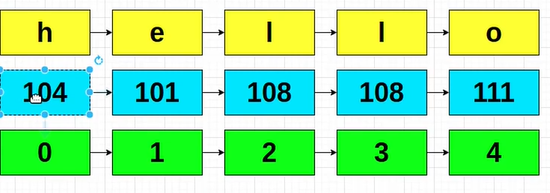
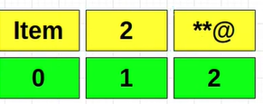

# Python-Beginners-full-work

## What is Python?

Python is a dynamic language.

### What is a comment

Something that is not interpreted by the python interpreter

```python
# This is a comment

"""
This is a multiline comment
"""
```

### What is a string?

A list of characters

By default, python 3 treats all characters as UTF8



### What is a list?

A list is an ordered collection of data.

Example:

